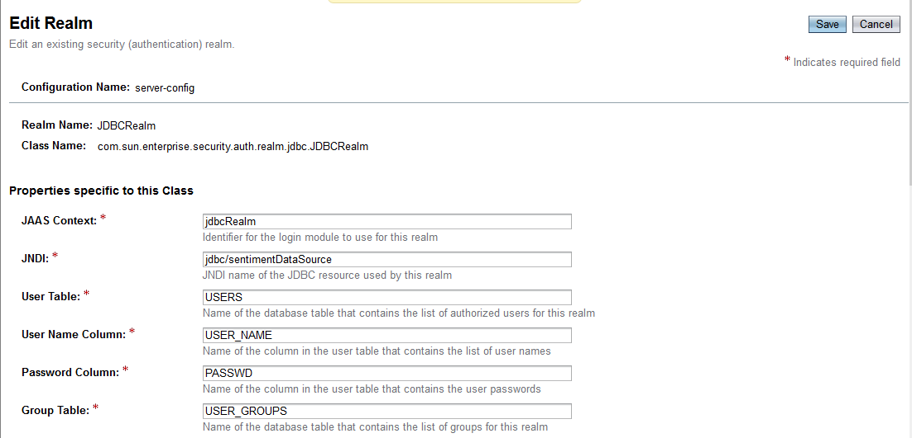
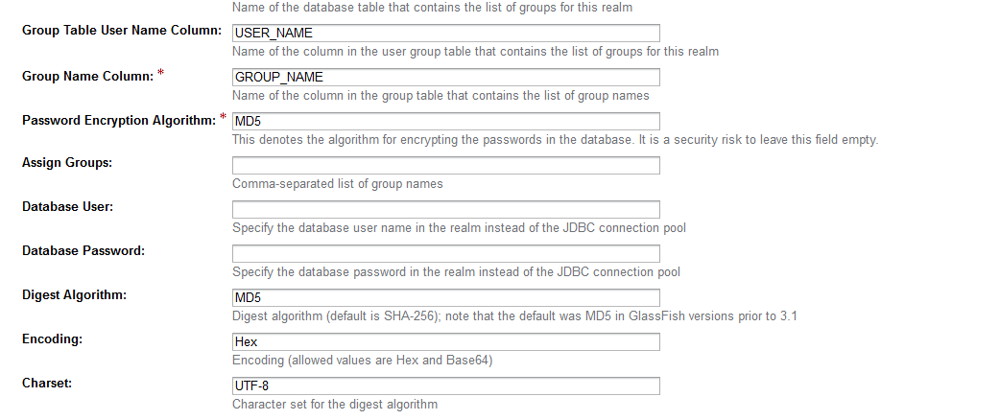
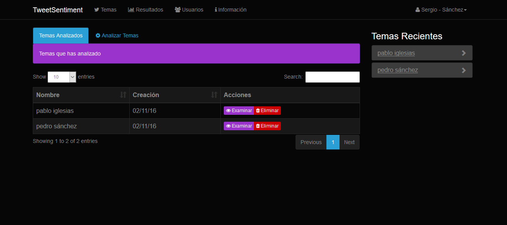
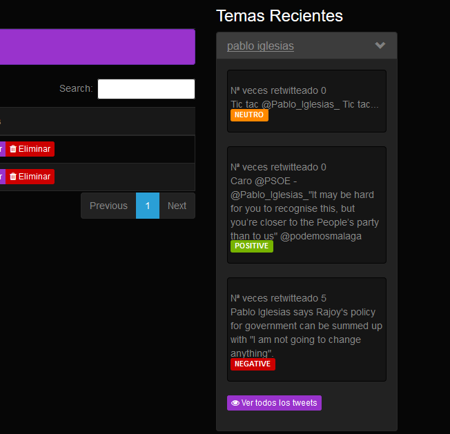
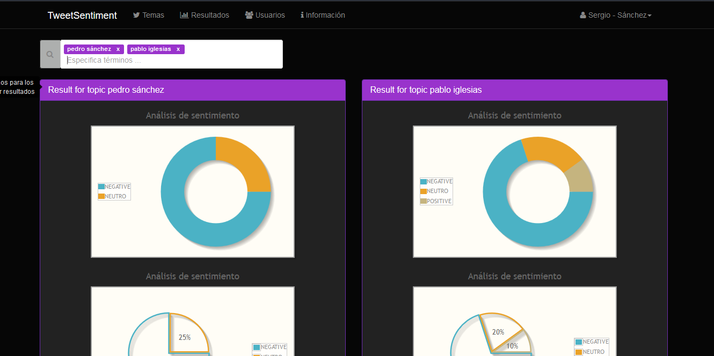

# A Twitter Sentiment Analysis tool build with JSF + Primefaces and Stanford CoreNLP
Sentiment Analysis Twitter with Stanford CoreNLP

## JDBCRealm configurations for this application

## Análisis de temas

## Sentimiento para cada tema

## Visualización de resultados

